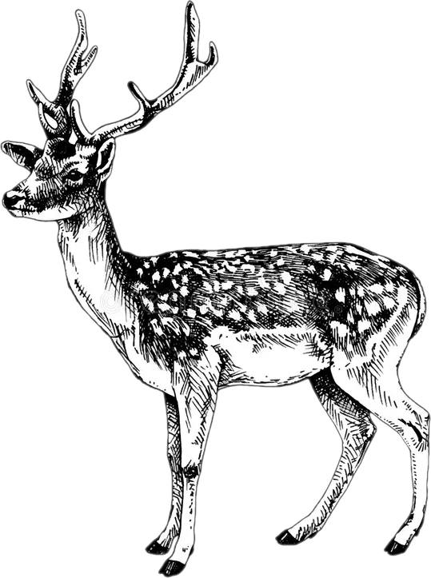

# Leslie matrix projection and culling model for feral fallow deer (<em>Dama dama</em>) in South Australia

## Scripts
- <code>fallow deer projection model.R</code>: includes five separate models: (<em>i</em>) deterministic projection, (<em>ii</em>) stochastic projection, (<em>iii</em>) stochastic projection with generationally scaled catastrophic mortality function, (<em>iv</em>) stochastic projection with catastrophic mortality and density feedback, and (<em>v</em>) harvest (culling) model.
- <code>matrixOperators.r</code>: functions for matrix manipulation

## R libraries
<code>deSolve</code>, <code>dplyr</code>, <code>ggplot2</code>, <code>ggpubr</code>, <code>patchwork</code>, <code>plotly</code>, <code>readr</code>, <code>tidyr</code>, <code>viridis</code>

 
 

 

